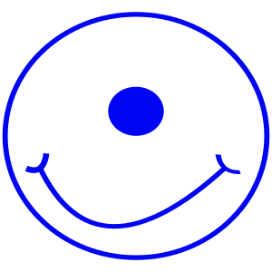
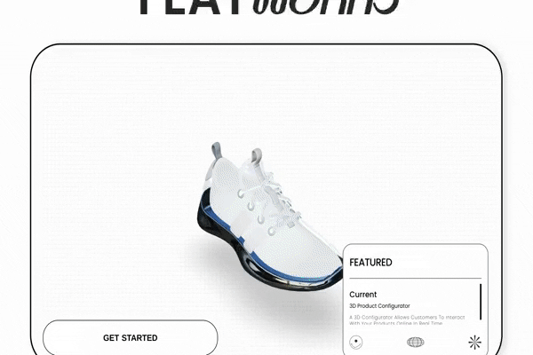
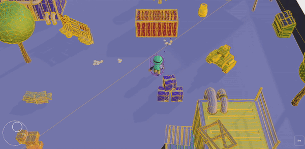
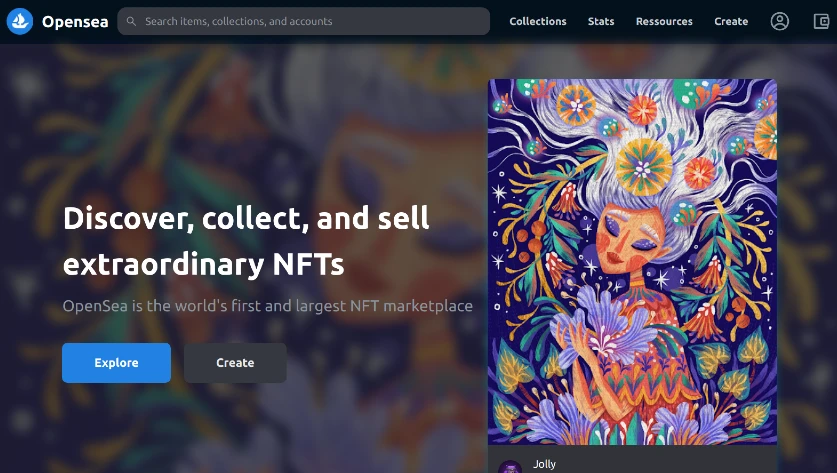
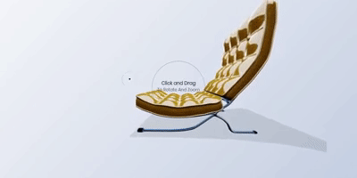
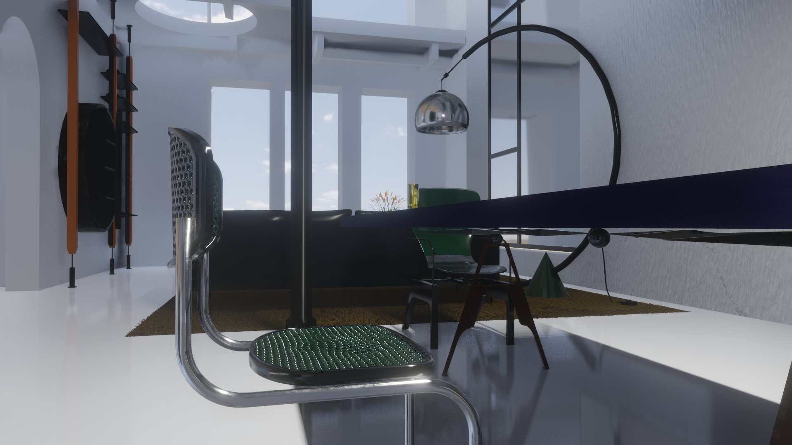
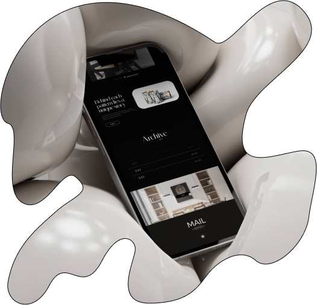

<!--  

 
 
  

  

 

-->
 
 
 
folio 🦄 :  https://nadiamariduena.com/

 

 

 
 

 

<!--  

Work in progress

 1. #### Stack:
2. 
3. react | redux  | mysql | stripe | apache |  strapi | redux-toolkit | framer-motion 
4. 
5. https://github.com/nadiamariduena/eshop-strapi-duplicate
6. 
7. https://user-images.githubusercontent.com/58809268/232027103-14dadce3-7433-4857-8f3d-b00156ccc992.mp4
8. 
9. 
10. 

 

-->
 
 

 
 
 

  
 
  
  
   
  
## 🟡 past /Work in Progress 

  

Click to unfold all the previous versions
 
 

 ##   Work in Progress 

 🟠 April, 2024 (3D multiplayer mobile shooter game)

 This project is a 3D multiplayer mobile shooter game built using Playroom and React Three Fiber, offering immersive gameplay experiences on mobile devices.
 
  

 
 

  

 

In Progress
Test the progress: here 🦄 https://game00-work-in-progress.netlify.app/

  

 
   

   

 

  
 
 
 

 🟠 Nov 6, 2022 (draggable component)
 https://nemu-mobile-store.netlify.app/
 
  

https://user-images.githubusercontent.com/58809268/200151365-e9cddb02-9aa6-4c20-af36-e8c8839aff25.mp4

  

      
   
 

  
 
  
 

 

NFT Beginner
 
   
 

# 
   
### OpenSea marketplace [repo](https://github.com/nadiamariduena/opensea-marketplace)  
#### Stack: Blockchain Web 3.0 App with  Next.js | Sanity.io | thirdweb | Tailwind | Alchemy
   
 
  
   
   
   
     
 

      

    

 

3d stuff
 
   
 

**CREDITS:** Barcelona Chair inspired by **Mies Van der Rohe**

      
    
   
   
 
    

 
   

 
 

## Recent projects 

- Surrealist site

  

 
   
 
 
 
