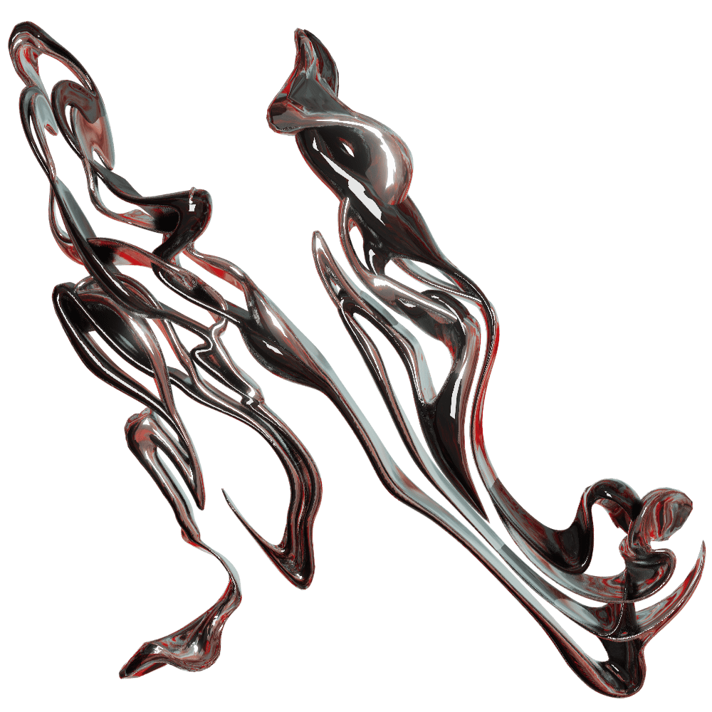

 

<!--  

 
 
  

  -->
 
### HELLO I'm into 3D, web surrealism & most recently "AR x android"...👾  

**(Below)**: A scene I cooked for my Folio. I used Blender and (react-three-fiber)
 

 

Januar 20, 2023 (new folio)

https://nadiamariduena.com/

  
  
 Nov 6, 2022 (draggable component)
 https://nemu-mobile-store.netlify.app/
 
  

https://user-images.githubusercontent.com/58809268/200151365-e9cddb02-9aa6-4c20-af36-e8c8839aff25.mp4

  

 

 
 

   
    
 
   
    
      
        
 

## Work in Progress 

 

Click to unfold all the previous versions
 
   
 
 
 #### Nov 2.2022
   
    
   
   

https://user-images.githubusercontent.com/58809268/199617082-1df3164a-4c7f-4e23-a991-d00afee0dff5.mp4
 
 
  
 
  #### Nov 15. 2021

https://user-images.githubusercontent.com/58809268/200211392-534ceae4-b866-4068-8e0a-370c71103e69.mp4

 
   
 
 #### Oct 27, 2021 
 

https://user-images.githubusercontent.com/58809268/200209296-c0729554-bdb3-457e-a80c-3fb73be51880.mp4

 
  

      
   
 

  
 
  
   
 

 

NFT Begnner
 
   
 

# 
   
### OpenSea marketplace [repo](https://github.com/nadiamariduena/opensea-marketplace)  
#### Stack: Blockchain Web 3.0 App with  Next.js | Sanity.io | thirdweb | Tailwind | Alchemy
   
 
  
   
   
   
   
     
 

    

 
   

    
 

 

3d stuff
 
   
 

**CREDITS:** Barcelona Chair inspired by **Mies Van der Rohe**

      
    
   
   
 
    

 
   

