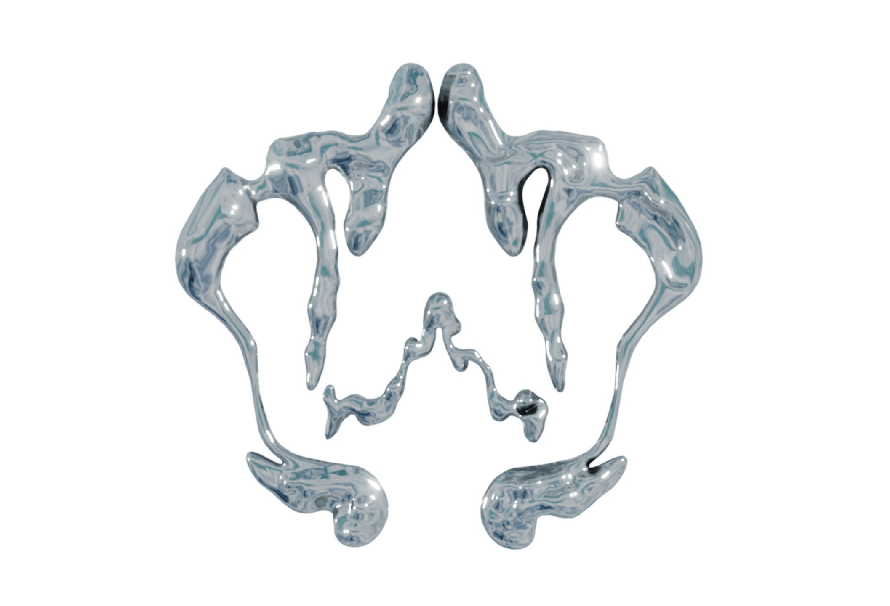

 

 
 
  

    
 
### HELLO I'm into 3D, web surrealism & most recently "AR x android"...👾  

**(Below)**: A scene I cooked for my Folio. I used Blender and (react-three-fiber)

 

  

 

 
 

   
    
    
 
     
   
    
 
   
   
 

 

Projects in Progress
 
   
 

# 
   
### OpenSea marketplace [repo](https://github.com/nadiamariduena/opensea-marketplace)  
#### Stack: Blockchain Web 3.0 App with  Next.js | Sanity.io | thirdweb | Tailwind | Alchemy
   
 
  
   
   
   
   
     
 

    

 
   

    
 

 

3d stuff
 
   
 

**CREDITS:** Barcelona Chair inspired by **Mies Van der Rohe**

      
    
   
   
 
    

 
   

